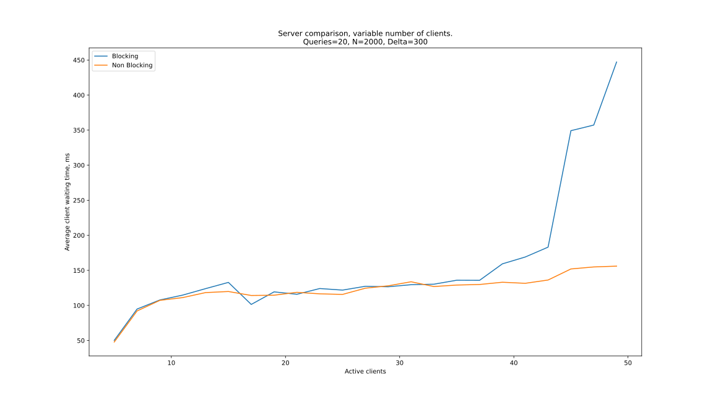
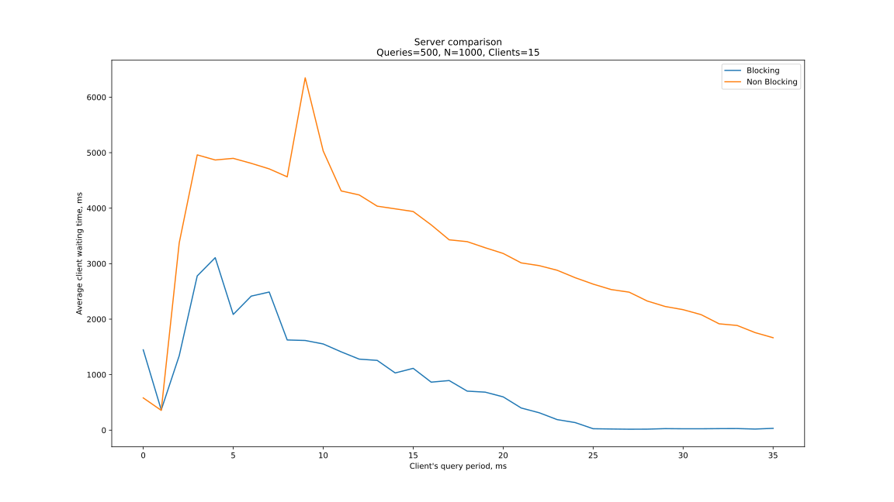
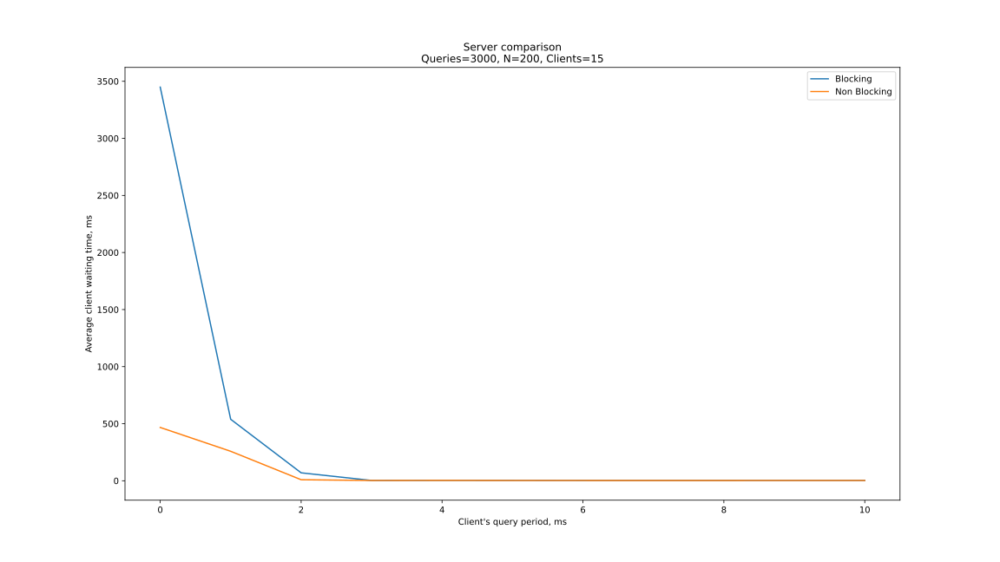
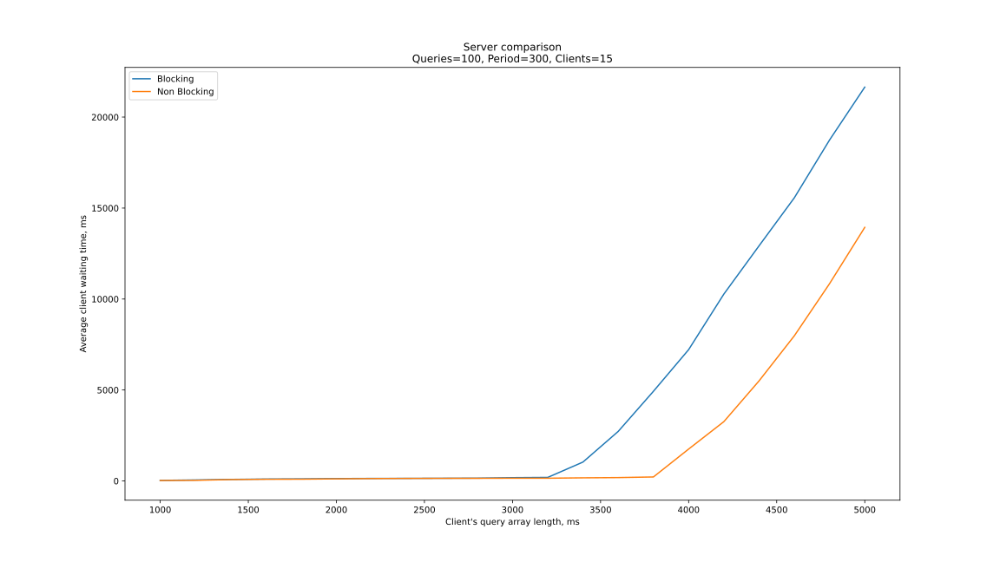

# Результаты

## Реализация

Были реализованы 2 архитектуры серверов: блокирующая и
неблокирующая. Подключение новых клиентов в обоих архитектурах
реализовано блокирующим методом. На каждого отправляющего клиента
при тестировании выделяется 3 потока: основной, читающий и
отправляющий, для гарантии того, что запросы отправляются на
сервер с нужной периодичностью.

## Метрика

В качестве метрики выбрано время ожидания ответа клиентом
от сервера. Началом отсчета считается начало отправки,
концом же - конец считывания ответа.

## Полученные результаты и анализ

### Переменное число клиентов

Видимая разница начинается при ~40 клиентах,
после этого момента время ожидания блокирующей
архитектуры резко увеличивается, в то время как неблокирующей - не сильно меняется.
Такой резкий взлёт
выходит видимо потому, что в один момент TP сервера
не успевает работать так быстро, чтобы не образовывалось очереди
ожидания. Возможно, что он замедляется потому, что для
блокирующей архитекруры требуется много потоков
на чтение и запись и процессору не хватает ресурсов
для должного обслуживания TP. В то время как
при неблокирующей архитектуре всего 1 читающий и пишущий
поток, а размер данных не настолько большой (1000 элементов в массиве),
чтобы частая смена контекста сыграла бы большую роль.

### Переменный период отправки запросов

Было проведено достаточно много опытов, но часто получалось
так, что при периоде отправки от 0 до 5 мс время
ожидания росло, что кажется контринтуитивно. При таком периоде,
фатически, все запросы отправляются на сервер одновременно,
а потом они читаются и выполняются сервером так быстро, как может TP.

Попробую объяснить такой эффект.
Возможно, массивы настолько быстро отправляются,
что их удаётся прочитать меньшим числом чтений со стороны сервера,
то есть за одно чтение обе архитектуры справляются
прочитать более одного запроса, точнее столько, сколько
помещается в физический буффер.
Такого бы, скорее всего, не получилось при передаче
по интернету, ведь тут важно, что время передачи
между сокетами очень мало.
При увеличении периода отправки серверу не удаётся считывать
по многу запросов за один раз, так как следующие
запросы ещё не отправлены, поэтому время
работы подскакивает. Значит, если верить этой гипотезе, то при большом числе
запросов от каждого клиента и малой длине массива "ямы" в начале не было бы.
Я проверил эту гипотезу и она нашла подтверждение в следующем измерении.

Далее же неблокирующая архитектура начинает работать
медленнее. При параметрах данного измерения
от 1 клиента нужно получить 3 * 10^6
чисел, причем данные поступают постоянно. Тут проявляется
минус неблокирующей архитектуры: всего один поток занят
чтением и один записью, им приходится постоянно менять
контекст и время работы возрастает. В то время как
при блокирующем чтении/записи потоки просто почти постоянно
работают и не замедляют сервер так сильно.

### Переменная длина массива

До длины массива ~3000 элементов на серверах не
образуется очередей из запросов: их удается обработать
до того, как придут другие запросы. Время ожидания
увеличивается только с временем работы
квадратичной сортировки. Значит всё зависит от того,
на каком сервере раньше начнут образовываться очереди.
Из измерений мы видим, что "застои" начинают образовываться
раньше при блокирующей архитектуре. Происходит
это, скорее всего, из-за того, что очень много ресурсов
(потоков)
выделяется под чтение и запись, а время чтения и
записи очень мало по сравнению с временем обработки
запроса клиента (которое уже достаточно велико при квадратичной
сортировке 3000 элементов). Выходит, что
читающие и пишущие потоки блокирующего сервера много простаивают.
Поэтому ресурсы раньше заканчиваются
у блокирующей архитектуры и время работы начинает линейно расти,
как и у неблокирующей, начиная с ~4000 элементов в массиве.
